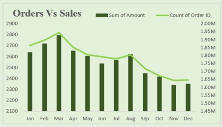
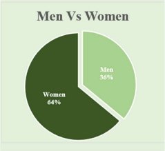
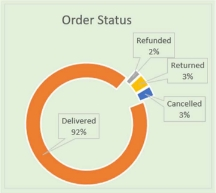
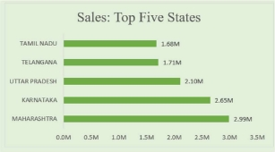
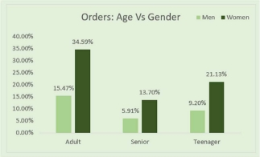
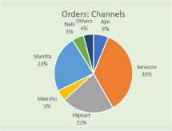

Objective 

Vrinda store wants to create an annual sales report for 2022. So that, Vrinda can understand their customers and grow more sales in 2023. 

` `Questions 

1  Compare the sales and orders using single chart 

2  Which month got the highest sales and orders? 

3  Who purchased more- men or women in 2022? 

4  What is different order status in 2022? 

5  List top 10 states contributing to the sales? 

6  Relation between age and gender based on number of orders 7  Which channel is contributing to maximum sales? 

8  Highest selling category? , etc. 

1\.Ans: Compare the sales and orders using single chart 

2\.Ans: According to chart created March holds the highest sales. 3. Who purchased more- men or women in 2022? 

4\.Ans: What is different order status in 2022? 

5\. Ans : List top 5 states contributing to the sales? 

6\.Ans: Relation between age and gender based on number of orders 

7\. Ans: Which channel is contributing to maximum sales? 

Insights 

- Women are more likely to buy compared to men (~65%). 
- Maharashtra, Karnataka and Uttar Pradesh are the top 3 states in the sales. 
- Adult age group (30-49 yrs) is max contributing (~50%). 
- Amazon, Flipkart and Myntra channels are max contributors in the sales. 

Final Conclusion to improve Vrinda store sales: 

Target women customers of age group (30-49 yrs.) living in Maharashtra, Karnataka and Uttar Pradesh by showing ads/offers/coupons available on Amazon, Flipkart and Myntra. 
